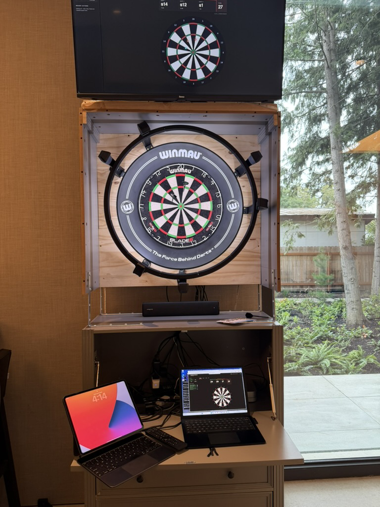

# opendarts

## Origin Story

I went to Flight Club and was obsessed with the game play there
compared to my electronic Spider 2000 dartboard. So obviously, I wanted to recreate
it.  I started by buying a Scolia system.  At first I thought it was magic, but
the more I understood it (and the fact they wanted 10 bucks a month for API access)
the more I wanted to replace it.  Then came Autodarts, almost the perfect
solution, but it annoyed me that I couldn't ship it with my FlightDeck
game!  With no other open-source steel tip dart scoring system out there,
I decided to just build it.

Things I think are cool about this project:

* I used multiple detection engines to try to get better accuracy than
Autodarts.  At the time of my limited testing, this is better than Autodarts,
but that's over a very small (<3k darts) sample size.

* It has a full replay mechanism. The scored packages contain the frames
used for calibration, the calibration itself, and the still frames we
scored on.  Optionally, it can include the full 6-12 frames used for
detection and scoring and has the ability to save the last 20 (configurable)
seconds of footage in case a dart doesn't get detected/scored.
It can all be replayed offline to improve detection and/or scoring.
STORE = SCORE is a first and core tenet for the project. You can view any
dart scored on the engines page. I would love a public repo of scoring packages!

* You can hook this directly up with Autodarts or another oracle if you
want a second opinion. A lot of work was put into figuring out how you
could run another oracle next to OpenDarts.  Each OS had their own special
implementation. Please spend 2 mins to read [STREAMING.md](docs/STREAMING.md)
to see how I got around some problems.

* Testing was hard.  This was built on a Mac, but I had to test on Windows and
Linux.  So I built a network stream camera path that allowed me to run 3 VMs
that would "watch" the live dartboard and score.  Each VM independently
calibrated, captured, and scored each dart. Additionally, I had to try
on multiple cameras and slightly off angles/distances.  So, I had my Scolia
set next to an Etsy 3D printed Autodarts setup.



That's my prototype board cabinet as I figure out what I want to build. You
can see how I had two sets of three cameras set up for scoring.  In
hindsight, I would have made the opening bigger so the cameras could be
properly offset from each other. Anyhow, hack away and enjoy.

Lastly, learnings.  If anyone wants to do crazy stuff with this or wants
to embark on a similar project, know this:

* Calibration is the most important thing.  Without it, it doesn't matter
how good your dart detection is.  This probably took the longest.

* Scoring engines are easy.  I obviously didn't write this by hand.
Multiple LLMs were independently given the task to score darts and each
came up with a slightly different method.  The only guidance given was
develop a 2d vs 3d method.

* I wish I had the network streaming test setup earlier.  It would have
helped do a lot.  Same with the video raw frames and package replay stuff.

* Darts rule!

## What this is

Camera-based automatic scoring for steel-tip darts.

Three cameras watch the board. When a dart lands, the rig freezes a frame
set, finds the dart in each view, and resolves a single `(sector, ring)`
call. Four independent scoring engines run on the same frames and vote on
that call. Each call can optionally be compared against
[Autodarts](https://autodarts.io) to measure accuracy.

Built to be hobby-friendly: commodity USB cameras, no custom hardware, and
everything runs on one machine.

## How the scoring works

Four engines score every throw independently. They are not variations on
one idea — each starts from a different piece of evidence, so they tend to
fail in different situations rather than all at once.

**Apollo — 3D, from the dart's tip.**
Finds the very tip of the dart in each camera image, draws a line from each
camera out through the tip it found, and takes the point in space where
those three lines come closest to meeting. Textbook triangulation, and the
oldest engine here.

**Talos — 3D, from the whole shaft.**
Triangulates like Apollo, but tracks the length of the shaft instead of
relying on one tip pixel, which is the easiest thing to get slightly wrong.
It then slides the answer along the dart's own axis to where the board
surface actually is — a dart sits *in* the sisal, a millimetre or two
behind the wire, not on the face of it.

**Athena — 2D, three separate opinions.**
Never triangulates. Each camera works out on its own where the dart crosses
the board plane and scores a complete answer, so three independent calls
come back. Those are then combined by how much each camera trusts its own
read, rather than by simple majority — two cameras sharing the same bad
angle would otherwise outvote the one camera that had it right.

**Ares — 2D, where the shaft lines cross.**
Draws each camera's view of the shaft onto the flat board face and looks
for the spot where those lines agree. It deliberately ignores the flight,
which is wide, brightly coloured, and drags the fitted line off by
millimetres if you let it into the measurement.

**Zeus** is not a fifth engine — it is the combiner that runs the other
four against the same frames and takes the `(sector, ring)` most of them
returned, with Apollo holding the tie-break. It needs answers from at least
three of the four. Zeus is what scores a throw by default.

See `docs/ENGINES.md` for the interface and how to add one.

## Requirements

- **Python 3.12** or newer
- Three USB cameras that can be opened simultaneously
- A dartboard, and enough light that the cameras see it

Linux, macOS and Windows are all supported. On Windows OpenDarts reads the
cameras with its own Media Foundation reader, which hands over each
camera's own JPEG; other software on the same machine reads the virtual
cameras OpenDarts publishes instead. See `docs/WINDOWS.md`.

### System packages

Python dependencies are in `requirements.txt` and `run.sh`/`run.ps1`
install them; running the tests needs `requirements-dev.txt` as well.
These are the things a package manager has to provide, and **only Linux
needs any**:

| Platform | Needed for | Package |
|---|---|---|
| Linux | creating the virtualenv | `python3-venv` |
| Linux | sharing the cameras with other software (optional) | `v4l2loopback` — see `docs/LINUX.md`, the package name depends on Secure Boot |
| Linux | camera diagnostics (optional) | `v4l-utils` |
| macOS | — | nothing; AVFoundation is in the base system |
| Windows | — | nothing; the virtual-camera filter is bundled |

Linux still needs your user in the **`video`** group to open a camera at
all, which fails with a message that points at hardware rather than
permissions.

**You are not expected to install these by hand.** `./run.sh` checks for
them on startup and offers to run `sudo ./scripts/setup_linux.sh`, which
installs the lot and adds you to the group — including taking the group
change into effect on that same run, with no logout. It only offers when
something is actually missing, and only when there is a terminal to ask
at, so an unattended start prints the instructions and carries on rather
than hanging on a password prompt.

`./scripts/check_linux_cameras.sh` checks the same things and changes
nothing. It is read-only and needs no privileges.

## Running

OpenDarts runs from a checkout, not from a `pip install`: the launcher
keeps the code, the voice clips, the Windows camera filter and your own
`data/` directory together in one folder, and updates them together.

```sh
git clone https://github.com/richiela/opendarts.git
cd opendarts
```

Then:

```sh
./run.sh          # Linux / macOS
```

```powershell
powershell -ExecutionPolicy Bypass -File .\run.ps1    # Windows
```

Either one creates `.venv` if missing, installs `requirements.txt`, and
starts the live product — capture loop plus dashboard — on the port in
`data/config.json` (default `8420`). Both restart the process if it
exits.

Then open `http://localhost:8420` and press **Start**.

For a kiosk or wall display nobody will touch, add `?sound=on` to the URL
(e.g. `http://localhost:8420/?sound=on`) to turn spoken calls on for that
screen. Browsers still want one tap before playing audio unless launched
with an autoplay policy that allows it, such as Chromium's
`--autoplay-policy=no-user-gesture-required`. Open dashboards reload
themselves when an update changes the page.

To run the module directly, without the restart wrapper:

```sh
./.venv/bin/python3 -m opendarts.live.run_product
```

## Configuration

Machine-local settings live in `data/config.json`, which is not tracked —
the same code runs on rigs with different hardware. `config.example.json` at
the repo root is a template showing every key and its default. It is
documentation only: the product never reads it, so editing it changes
nothing.

Most of it is also editable from the dashboard's **Config** tab, which is
the easier route: camera assignment, detection speed, the Autodarts
comparison, audio, whether throws are saved to disk, and whether each throw
also records a video clip.

## Throw packages

Every scored throw can be saved as a **replay package**: a self-contained
directory holding the exact inputs the throw was scored from, not just the
answer it produced — the empty-board frames, the scored frames, and the
calibration in force at capture.

That distinction is the point. Because the raw frames and the calibration are
both stored, the same throw can be re-scored later through newer code and
produce a *different, better* answer. It is what makes engine comparison and
accuracy regression testing possible without the rig — and what makes an
accuracy claim checkable rather than asserted.

A package is a few JSON files plus one MKV per camera holding the JPEG
frames that were actually scored — no re-encode, on every platform. By default
a saved throw also records a short **video clip** per camera around the moment
the dart landed, with the scored frame byte-identical inside it; a throw
without one still keeps its two frames (empty board, then scored) as a
two-frame clip. A recorded package is about 1.5 MB and a still-only one about
0.5 MB, so a corpus still runs to gigabytes per thousand darts — `Config →
Capture → Save throw packages` turns the whole thing off, and
`video_record_mode` turns off just the clips.

Replay a whole corpus against the current pipeline and see what moved:

```sh
./.venv/bin/python3 -m opendarts.capture.rescore_all --package-root data/packages
```

**`docs/PACKAGES.md` has the rest**: every file in a package and its size, what
`result.json` records per engine, how the clip window is chosen, the replay API,
and why a replay must never be used to measure engine speed.

## Tests

The test suite needs a few packages the product itself does not:

```sh
pip install -r requirements-dev.txt
pytest tests/           # fast tier (about a minute)
pytest tests/ --slow    # everything, including corpus replays
```

Some regression tests replay real captured frames. Those are large binaries
and are not tracked here, so the tests skip without them:

```sh
export OPENDARTS_FIXTURES_ROOT=/path/to/fixtures      # real-frame regressions
export OPENDARTS_ENGINE_CORPUS_ROOT=/path/to/sessions # accuracy corpus
```

Installing [Node.js](https://nodejs.org) is optional but recommended: one
test uses `node --check` to parse the dashboard's JavaScript, and it is the
only check that catches an unterminated string literal there. Without node
it skips, and says so.

## Layout

| Path | What it is |
|---|---|
| `opendarts/live/` | capture loop, dashboard, HTTP/WebSocket API |
| `opendarts/lifecycle/` | throw/takeout decision state machine |
| `opendarts/engines/` | scoring engines (see `docs/ENGINES.md`) |
| `opendarts/capture/` | throw packages, replay |
| `opendarts/calibration/` | camera intrinsics, board geometry solve |
| `opendarts/triangulation/` | ray building and intersection |
| `tools/` | the Windows virtual-camera filter and the voice-clip scripts |

### The one committed binary

`tools/winvcam/vcam_probe.dll` (1.3 MB) is checked in, and a binary in a
source repo deserves an explanation rather than a shrug.

**What it is.** A small DirectShow filter that publishes this rig's
cameras as virtual cameras on Windows, so other software can watch the
same board. Its full source is in the same directory —
`vcam_probe.cpp`, `vcam_probe.def`, `shared_frame.h` — and `build.sh`
compiles it.

**Why it is committed rather than built.** The machine that needs it is
a Windows rig, and building it needs mingw-w64 on macOS or Linux. The
target platform cannot compile its own copy. `opendarts/live/vcam_register.py`
resolves this exact path and disables the virtual-camera feature
entirely if the file is missing, so a checkout without it quietly loses
that capability.

**If you would rather not trust a binary you did not build**, run
`./build.sh` in `tools/winvcam/` and overwrite it. Nothing verifies a
checksum. A rebuild will not be byte-identical — mingw embeds timestamps
and build paths — so compare behaviour, not hashes; see
[`tools/winvcam/README.md`](tools/winvcam/README.md).

The other committed binaries are the spoken dart calls in
`assets/voices/` — two sets of 64 MP3 clips, about 1.1 MB. They are
generated with [Kokoro](https://github.com/hexgrad/kokoro) (Apache-2.0,
permissive voice packs) by `tools/voice/generate_kokoro_clips.py`, so they
can be shipped — and shipping them is the point.

Adding a voice is dropping a directory of clips into `assets/voices/`;
the directory name is what appears in the Config tab.

## Docs

- `docs/DESIGN.md` — architecture and standing design constraints
- `docs/ENGINES.md` — the engine interface and how to add one
- `docs/LIFECYCLE.md` — how throws and takeouts are decided
- `docs/PACKAGES.md` — what a saved throw holds, and how to replay one
- `docs/CAMERAS.md` — what the cameras actually send, and why macOS encodes its own JPEG
- `docs/LIVE_API.md` — the full HTTP and WebSocket surface
- `docs/RETAIL_API.md` — the smaller surface a scoreboard or game client needs
- `docs/CALIBRATION.md` — how the board solve works
- `docs/DEPLOYMENT.md` — running on a dedicated rig: configuration, disk use, the diagnostics switch, security
- `docs/STREAMING.md` — sharing cameras over the network and with another scorer on the same machine
- `docs/WINDOWS.md` — Windows setup, including sharing the cameras with other software
- `docs/LINUX.md` — Linux setup: the `video` group, which `/dev/video*` are real, and sharing the cameras with other software

## License

Copyright © 2026 Richie Lai.

Licensed under the **GNU Affero General Public License, version 3 or later**
— free software, and open source under the OSI definition. Use it, study it,
modify it, redistribute it, and yes, use it commercially. See
[LICENSE](LICENSE) for the full terms.

One obligation comes with that. If you distribute a modified version, or let
other people use one over a network, you have to give them the complete
source under the same licence. That network clause (§13) is what makes this
AGPL rather than plain GPL, and it reaches a hosted service exactly as it
reaches shipped software. Running an unmodified copy on your own board at
home triggers nothing at all.

**Want to build something closed on top of this?** That is the one case the
AGPL rules out. A commercial licence removes the copyleft obligation — open
an issue saying so and I will follow up privately.

## Contributing

**Issues are very welcome. Pull requests cannot be merged yet** — see
[CONTRIBUTING.md](CONTRIBUTING.md), which also explains how to file a
useful bug report in one paste.

The reason is licensing, not disinterest. Selling a commercial exception to
the AGPL is only possible while a single party holds the rights to all of
the code, and a merged contribution stays owned by whoever wrote it. Until a
contributor licence agreement is in place, merging one would permanently
remove that option.

Describing a fix in an issue is fine and gets you credit — ideas are not
copyrightable, only their expression is. If you have something
substantial, open an issue and say so; the agreement can be set up then.
